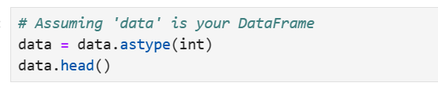
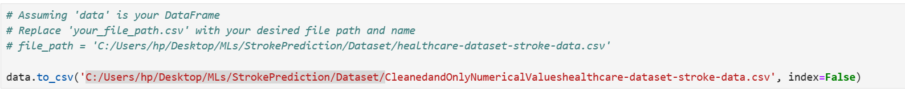

# EDAStrokePrediction
Exploratory Analysis on Stroke Prediction System
# Author

Name: Jacinta Chioma Odirichukwu (PhD in Computer Science)
Phone: +2348153496082
Email: lmssmarthub@gmail.com

# 1.  Data Collection: 
Download Dataset

To use this project, you need to download the dataset from the following URL:

[**Download Dataset**](https://www.kaggle.com/datasets/fedesoriano/stroke-prediction-dataset)

Please ensure that you have the necessary permissions to access and use the dataset according to its licensing terms. Once downloaded, you can place the dataset file in the appropriate directory within your project.

# 2.  Data Exploration:Explored the dataset to understand its structure, features, and distributions.
Identified potential relationships between features and the target variable (price).
### Load the dataset from where you store it and view it using the code below

### Output for stroke dataset view

### view the first five rows using this code

### Result for view the first five rows

### view the last five rows using this code

### Result for view the first five rows

### Check data types and missing values

### Result for Checking data types 

### Check missing values

### Result for missing values

### Statistical summary

### Output Statistical summary

### Check for duplicates

### Output Check for duplicates

### Handling missing values using fill forward (ffill)

### Output Handling missing values, you can see that missing bmi at row 1 has been filled
### Notice that NaN has been filled with 36.6, that is the function of ffill method

### Encode categorical variables

### Output for Encode categorical variables

# Check for missing values to see if it is filled
missing_values = data.isnull().sum()
print("Missing Values:\n", missing_values)
### Output showing that, there are no more missing data

### Code to Extract numerical columns

### Output for the numerical column

### Drop the id column

### Convert all datatype to integer

### Output for dataset in numerical form

### Save the cleansed data as new dataset and save it in your local machine.

# Conclusion
The dataset was cleaned and normalized as part of an exploratory data analysis before being utilized to train the model.
